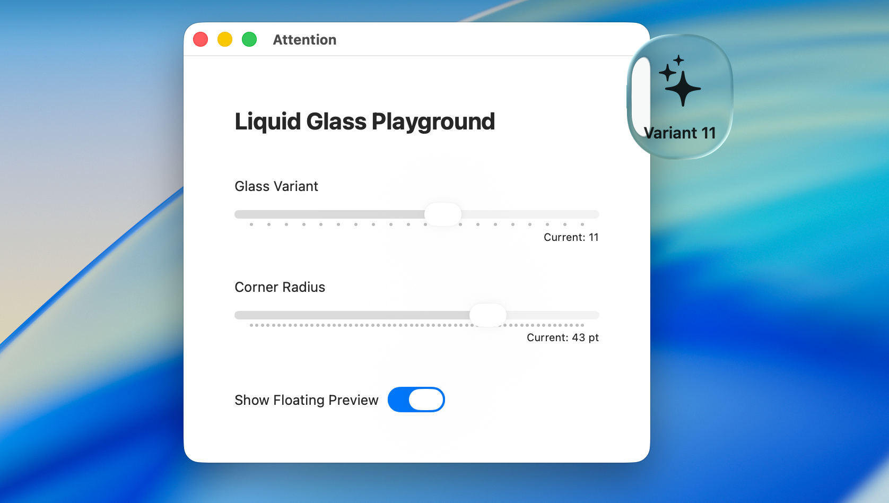

# Liquid Glass Swift

Use ALL VARIANTS of liquid glass in your own Swift projects. Also includes a demo app that lets you **visually explore all 20 private liquid-glass variants**.

## ⚡️ Quick Start

1. Clone / drop **`LiquidGlassBackground.swift`** and **`LiquidGlassDemo.swift`** into the same Xcode project.  
2. Build & run (you need Xcode beta)
3. Use the two sliders to switch variants (0 – 19) and adjust the corner radius on the fly.  
4. Toggle the *Floating Preview* switch to pop out a draggable glass panel you can inspect over any window.  

## How it works

`LiquidGlassBackground` wraps the private `NSGlassEffectView`, exposing its hidden **`variant`** property via Objective-C runtime tricks. The SwiftUI wrapper swaps in a standard `NSVisualEffectView` fallback when the class isn’t available, so the code still builds on earlier macOS versions.
